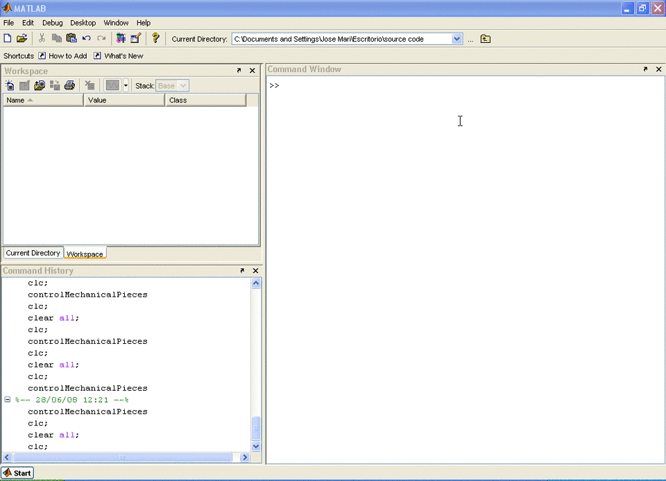

# pro2control

Quality control of mechanical pieces by artificial vision

This system (http://youtu.be/aX5LBr8o0SA) simulates an industrial chain using a process of stamping starting from metal sheetings. There are three types of pieces to analyze by using this vision system, IA04, 0863-012, and 5828-001 (see figures). The part reference IA04 is a snap ring more commonly called "circlips" in the industrial world. These rings are components of mechanical assembly generally used on the axes in order to carry out axial stops. The part which interests us can be placed in a gutter inside a tube or outside an axis. The part reference 0863-012 is "circlips" outside. The part has a circular external form. The interior aspect is more complex with four salient parts in the inner contour. Furthermore, it contains two holes making it possible to handle it with a grip envisaged for this purpose. Finally, the part reference 5828-001 is similar to 0863-012. The principal difference is that instead of having four salient parts, it has three salient parts in the inner contour. At the exit of the chain, the parts must satisfy dimensional tolerances (e.g., B) and qualities criteria and be not distorted. In the other hand, this system is inspired in the objectives of Pro2Control project: On-line control of Drawing and Blanking Processes and of Quality of the Product by Fusion of Sensors and Artificial Vision Techniques.

NOTE: Copy all files in Matlab current directory and type "controlMechanicalPieces" on Matlab command window.

The piece images included are taken from University of Mondragon.

